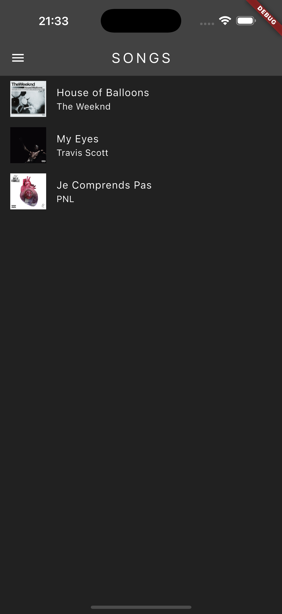

# Playify

## A. Personal Details
**Name**: Oussama Hassine  
**Matriculation Number (Matricola)**: 339002

## B. Project Title
**Playify: A Simple Music Player App**

## C. Project Overview
Playify is a user-friendly music player application built using Flutter. It allows users to enjoy a minimalistic yet functional experience with three hardcoded songs. Users can switch between light and dark themes, control playback (play, pause, skip, previous), jump within songs using a slider, and enable shuffle or repeat modes. The app is designed to be scalable across all screen sizes, ensures a consistent user experience by saving the selected theme, and locks the orientation to portrait mode to avoid accidental flips. The application runs seamlessly on both iOS and Android platforms.

## D. User Experience Overview
The app offers a clean and intuitive interface:
1. **Now Playing Screen**: Displays the current song, album artwork, and playback controls.
2. **Playback Controls**: Includes play, pause, skip, previous, shuffle, and repeat. The slider allows users to navigate within a song.
3. **Theme Persistence**: The light or dark mode preference is saved and restored when the app is reopened.

### Screenshots

#### 1. Now Playing Screen (Dark Mode)

#### 2. Now Playing Screen (Light Mode)

#### 3. Songs Page (Dark Mode)

#### 4. Settings Page (Dark Mode)

#### 5. Drawer (Dark Mode)

## E. Technology and Implementation Details

### Dependencies
- **`shared_preferences`**: To persist the user's theme preference across app sessions.
- **`provider`**: For state management, enabling seamless updates to the UI as the user interacts with the app.
- **`audioplayers`**: For playing audio files and controlling playback.

### Noteworthy Implementation Choices
- **Scalability**: The app leverages MediaQuery and Flexible widgets to adapt to all screen sizes, ensuring a consistent experience across devices.
- **Orientation Lock**: Fixed to portrait mode for a streamlined user experience.
- **Logic for Repeat and Shuffle**: Custom logic ensures shuffle does not repeat songs unnecessarily and repeat restarts the same song as intended.

### Challenges and Solutions
1. **Screen Dimensions**: Initially, hardcoded dimensions caused layout issues on smaller devices like the iPhone SE. Switching to percentage-based dimensions resolved this.
2. **Repeat and Shuffle Logic**: Developing logic to handle these playback modes while ensuring user expectations were met was challenging but rewarding.
3. **Time Formatting**: Formatting song duration to a user-friendly format (e.g., `2:34`) involved ensuring correct calculations and alignment with music industry standards.

### Future Improvements
- Adding support for dynamic song addition from local storage.
- Integrating a backend to fetch songs and metadata.
- Enhancing the UI with animations for better transitions and user feedback.

